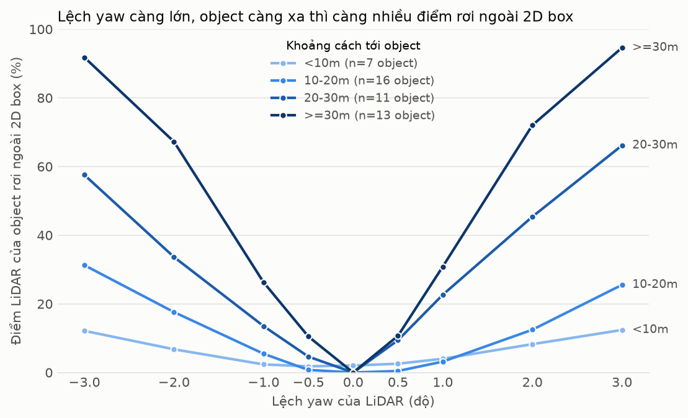
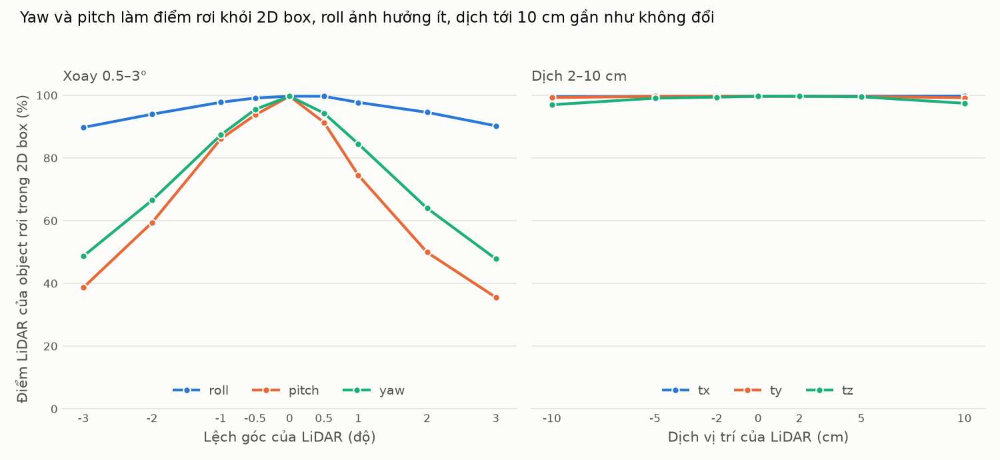
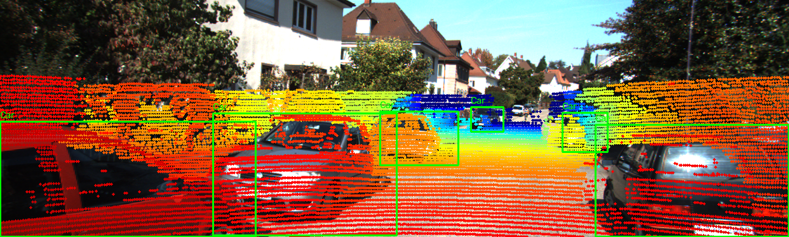
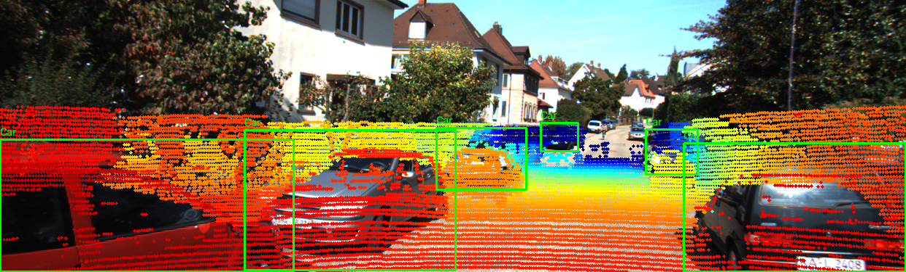
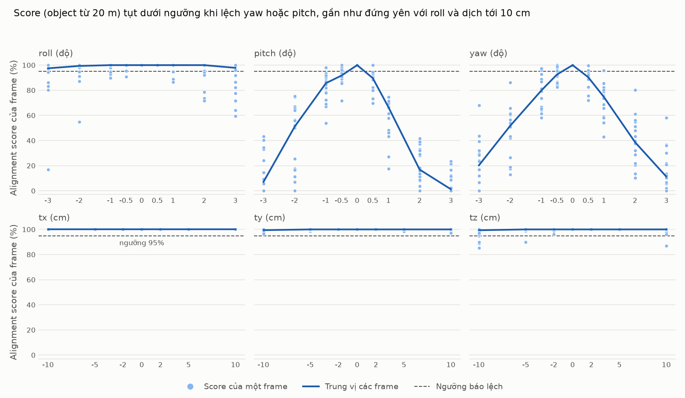
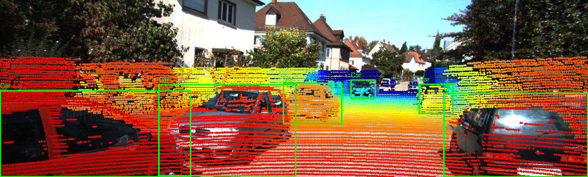
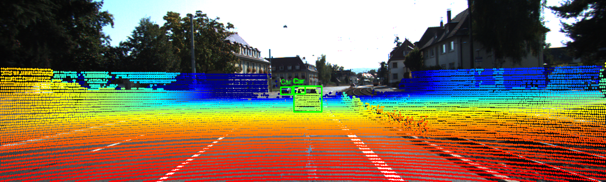
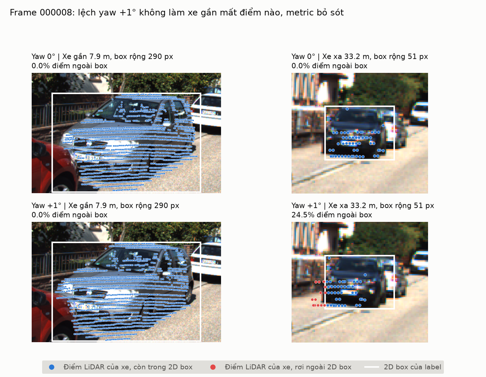
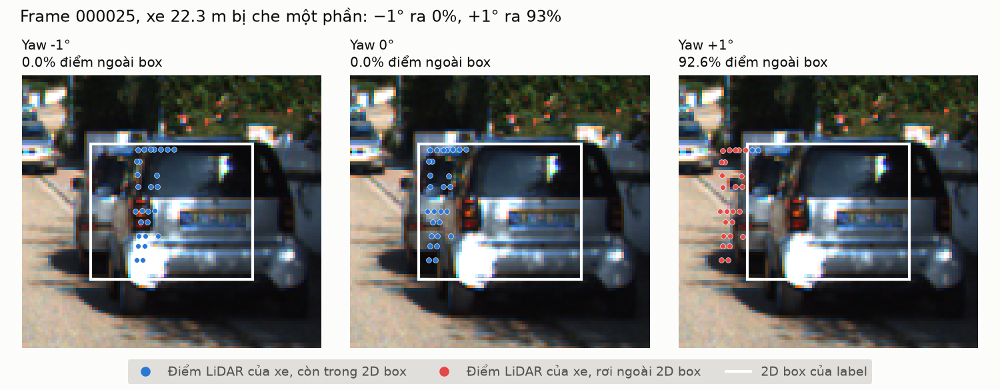
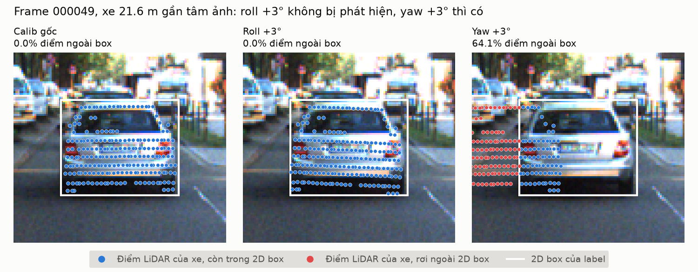

# Báo cáo Day 6: Độ nhạy của phép chiếu LiDAR–camera với lệch extrinsic

> Thay **mọi** ô có chữ ĐIỀN nằm trong ngoặc vuông bằng nội dung của bạn, xoá luôn cả dấu ngoặc vuông. Lệnh `python tools/check_submission.py` sẽ báo FAIL nếu còn sót bất kỳ chỗ nào.

- **Họ tên:** Đoàn Anh Quân
- **MSSV:** 2A202602803
- **Lớp:** AI20K-T4
- **Link repo:** https://github.com/DAQuan-VinAI/DoanAnhQuan-2A202602803-Track4-Day21
- **Topic:** A — LiDAR - camera projection QA
- **Dataset:**  data/synthetic, data/kitti_mini
- **Các frame đã dùng:**  các thí nghiệm quét lệch và alignment score dùng cả 20 frame của `data/kitti_mini`; ảnh demo dùng `data/synthetic` frame 000000 và `data/kitti_mini` frame 000008, 000009, 000011

> Hãy viết ngắn: mỗi mục từ 3 đến 8 dòng, ưu tiên số liệu và hình ảnh.

## 1. Claim

Một câu khẳng định kỹ thuật có thể kiểm chứng. Ví dụ: *"Lệch yaw 1° làm 12% điểm LiDAR rơi ra khỏi vật thể ở 30 m, phát hiện được bằng edge-alignment score với ngưỡng X."*

Lệch yaw 1° làm điểm chiếu dịch khoảng 13–15 px, gần như không phụ thuộc khoảng cách, trong khi 2D box hẹp dần khi xe ở xa (rộng trung bình 268 px ở dưới 10 m, 42 px ở từ 30 m). Vì vậy tỉ lệ điểm LiDAR rơi ra ngoài 2D box tăng theo khoảng cách: dưới 5% với xe ở gần hơn 10 m, nhưng 26–31% với xe ở 30 m trở lên.

Từ đó, một alignment score theo frame (trung bình % điểm trong 2D box của các xe từ 20 m) với ngưỡng 95% phát hiện lệch yaw hoặc pitch 1° ở 14–16 trên 16 frame và không báo nhầm frame nào ở 0°, nhưng bỏ sót lệch roll tới 3° (chỉ 5–7/16 frame) và dịch tới 10 cm (0–4/16 frame).


## 2. Evidence

Bảng hoặc plot số liệu, kèm ảnh/video demo. Ghi rõ đường dẫn file trong `results/`.

**Thí nghiệm chính (CP3): quét lệch yaw từ −3° đến +3°, 9 mức.** Số liệu: `results/yaw_perturb_sweep.csv` (mỗi dòng một mức yaw) và `results/yaw_perturb_per_object.csv` (từng object). Biểu đồ: `results/figures/yaw_perturb_sweep.png`.

- **Cách đo:** với mỗi xe, lấy các điểm LiDAR nằm trong 3D box của label (dùng calib gốc), chiếu lại bằng calib đã lệch yaw, rồi đếm tỉ lệ điểm không rơi vào 2D box của label.
- **Cấu hình giữ nguyên ở mọi mức:** 20 frame `data/kitti_mini`, class Car + Van + Truck, chỉ lấy object có từ 20 điểm LiDAR, occluded ≤ 1, truncated ≤ 0.5. Còn lại 47 xe: 7 xe dưới 10 m, 16 xe ở 10–20 m, 11 xe ở 20–30 m, 13 xe từ 30 m.
- **Seed:** thí nghiệm không có bước ngẫu nhiên nào; chạy lại hai lần cho hai file CSV giống hệt nhau (đã so md5).

| Lệch yaw | % điểm trong FOV | Dịch pixel trung bình (px) | % ngoài box, <10 m | % ngoài box, 10–20 m | % ngoài box, 20–30 m | % ngoài box, ≥30 m |
|---|---|---|---|---|---|---|
| -3.0° | 15.73 | 41.6 | 12.1 | 31.3 | 57.6 | 91.8 |
| -2.0° | 15.74 | 27.7 | 6.8 | 17.6 | 33.6 | 67.2 |
| -1.0° | 15.74 | 13.9 | 2.4 | 5.5 | 13.5 | 26.3 |
| -0.5° | 15.75 | 6.9 | 1.8 | 0.8 | 4.6 | 10.5 |
| 0.0° | 15.75 | 0.0 | 2.0 | 0.0 | 0.0 | 0.0 |
| +0.5° | 15.76 | 6.9 | 2.6 | 0.4 | 9.4 | 10.7 |
| +1.0° | 15.76 | 13.9 | 4.0 | 3.2 | 22.6 | 30.8 |
| +2.0° | 15.77 | 27.7 | 8.3 | 12.5 | 45.4 | 72.0 |
| +3.0° | 15.77 | 41.6 | 12.4 | 25.5 | 66.1 | 94.6 |

"% ngoài box" là trung bình theo từng xe, không theo từng điểm, để vài xe ở gần có hàng nghìn điểm không lấn át các xe ở xa.



**Xu hướng:** độ dịch pixel tăng tuyến tính theo yaw (khoảng 14 px mỗi độ), còn % điểm trong FOV gần như không đổi (15.73–15.77%) nên không dùng được để phát hiện lệch yaw. % ngoài box tăng theo cả yaw lẫn khoảng cách: ở ±1°, xe dưới 10 m chỉ mất 2–4% điểm, xe từ 30 m mất 26–31%; ở ±3°, xe từ 30 m mất 92–95%. Ở 0° nhóm dưới 10 m vẫn có 2.0% ngoài box, do một xe bị cắt ở rìa ảnh (frame 000016, truncated 0.5, 14.1% ngoài box).

**Mở rộng sang 6 trục (mức Good): roll, pitch, yaw ±0.5–3° và dịch tx, ty, tz ±2–10 cm.** Số liệu đủ 48 cấu hình: `results/extrinsic_perturb_sweep.csv` và `results/extrinsic_perturb_per_object.csv`. Biểu đồ: `results/figures/extrinsic_perturb_sweep.png`. Cách đo, 20 frame và 47 xe giống thí nghiệm yaw; mỗi lần chỉ một trục khác 0. Trục theo LiDAR: roll quanh x (hướng trước), pitch quanh y (sang trái), yaw quanh z (lên trên). "% trong box" bằng 100 trừ "% ngoài box" của bảng trên. Mỗi ô ghi hai giá trị cho chiều âm / chiều dương.

| Mức lệch | % điểm trong FOV | Dịch pixel (px) | % trong box, mọi xe | % trong box, xe ≥30 m |
|---|---|---|---|---|
| Không lệch | 15.75 | 0.0 | 99.7 | 100.0 |
| Roll ±1° | 15.75 / 15.76 | 3.0 | 97.8 / 97.7 | 98.8 / 97.2 |
| Roll ±3° | 15.77 / 15.79 | 9.0 | 89.7 / 90.3 | 84.1 / 85.3 |
| Pitch ±1° | 16.52 / 15.02 | 12.9 | 86.1 / 74.5 | 80.8 / 44.5 |
| Pitch ±3° | 17.98 / 13.50 | 38.6 / 38.8 | 38.7 / 35.6 | 1.5 / 0.0 |
| Yaw ±1° | 15.75 / 15.76 | 13.9 | 87.4 / 84.5 | 73.7 / 69.2 |
| Yaw ±3° | 15.73 / 15.77 | 41.6 | 48.7 / 47.8 | 8.2 / 5.4 |
| tx ±10 cm | 15.49 / 16.08 | 1.4 / 1.3 | 99.6 / 99.8 | 100.0 / 100.0 |
| ty ±10 cm | 15.75 / 15.76 | 4.5 | 99.2 / 99.2 | 99.3 / 99.6 |
| tz ±10 cm | 15.14 / 16.48 | 4.5 | 97.0 / 97.4 | 97.0 / 99.9 |



Pitch gây hại ngang yaw (khoảng 13 px mỗi độ) và là trục duy nhất làm % điểm trong FOV đổi rõ (13.5–18.0%). Roll chỉ dịch 3 px mỗi độ. Dịch 10 cm chỉ dịch 1.3–4.5 px nên % trong box gần như không đổi.

Ảnh overlay khi đã lệch, `data/kitti_mini` frame `000008` (so với ảnh chưa lệch của cùng frame ở phần demo bên dưới):

Yaw +2° — `results/figures/overlay_000008_r0.0_p0.0_y2.0_t0.0_0.0_0.0.png`



Pitch +2° — `results/figures/overlay_000008_r0.0_p2.0_y0.0_t0.0_0.0_0.0.png`



**Alignment score và ngưỡng phát hiện drift (mức Advanced).** Số liệu: `results/alignment_score_per_frame.csv` (score từng frame) và `results/alignment_score_detection.csv` (số frame bị báo lệch theo ngưỡng). Biểu đồ: `results/figures/alignment_score_threshold.png`.

- **Score của một frame** = trung bình, theo từng xe, của % điểm LiDAR rơi trong 2D box, chỉ tính các xe từ 20 m trở lên (box hẹp nên nhạy, xem failure 1). Báo lệch khi score < ngưỡng.
- **Dữ liệu:** 16 trên 20 frame có score (24 xe từ 20 m, mỗi frame 1–3 xe). 4 frame còn lại không có xe nào đủ điều kiện nên không đo được.
- **Ngưỡng chọn: 95%.** Mỗi ô là số frame bị báo lệch, chiều âm / chiều dương.

| Cách tính score | Ngưỡng | Báo nhầm ở 0° | Yaw ±0.5° | Yaw ±1° | Pitch ±1° | Yaw, pitch ±2° | Roll ±3° | ty ±10 cm | tz ±10 cm |
|---|---|---|---|---|---|---|---|---|---|
| Xe ≥20 m | 99% | 0/16 | 14 / 15 | 16 / 16 | 16 / 16 | 16 / 16 | 11 / 8 | 8 / 5 | 8 / 3 |
| **Xe ≥20 m** | **95%** | **0/16** | **11 / 14** | **14 / 15** | **15 / 16** | **16 / 16** | **5 / 7** | **0 / 0** | **4 / 1** |
| Xe ≥20 m | 90% | 0/16 | 5 / 5 | 13 / 15 | 12 / 16 | 16 / 16 | 4 / 6 | 0 / 0 | 3 / 1 |
| Mọi xe | 95% | 1/17 | 11 / 8 | 15 / 15 | 17 / 17 | 17 / 17 | 8 / 9 | 1 / 1 | 4 / 3 |



- **Kết quả ở ngưỡng 95%:** lệch yaw hoặc pitch từ 2° bị phát hiện ở cả 16 frame, 1° ở 14–16 frame, 0.5° ở 11–15 frame. Roll 3° chỉ bị phát hiện ở 5–7 frame, dịch 10 cm ở 0–4 frame (tx ±10 cm là 0/16 ở mọi ngưỡng).
- **So sánh hai cách tính score:** tính trên mọi xe thì báo nhầm 1 frame ở 0° (frame 000016, score 92.9% do một xe bị cắt ở rìa ảnh) và kém nhạy hơn với yaw +0.5° (8/17 so với 14/16).
- **Giới hạn của ngưỡng:** ở 0° cả 16 frame đều ra đúng 100%, vì với calib gốc mọi điểm nằm trong 3D box của các xe này đều chiếu vào trong 2D box của label. Vì vậy dữ liệu này không ước lượng được tỉ lệ báo nhầm thật. Ngưỡng 95% là mức chừa 5 điểm dự phòng do mình chọn, chưa phải ngưỡng tối ưu; với box từ detector, score ở 0° sẽ thấp hơn 100% và ngưỡng phải đo lại.

**Demo CP2 — điểm LiDAR chiếu lên camera, có vẽ 2D box của label (chưa perturb: roll/pitch/yaw = 0°, t = 0):**

`data/synthetic`, frame `000000` — `results/figures/overlay_000000_r0.0_p0.0_y0.0_t0.0_0.0_0.0.png`


`data/kitti_mini`, frame `000008` — `results/figures/overlay_000008_r0.0_p0.0_y0.0_t0.0_0.0_0.0.png`



`data/kitti_mini`, frame `000009` — `results/figures/overlay_000009_r0.0_p0.0_y0.0_t0.0_0.0_0.0.png`



`data/kitti_mini`, frame `000011` — `results/figures/overlay_000011_r0.0_p0.0_y0.0_t0.0_0.0_0.0.png`


## 3. Failure case

Nêu khi nào hệ thống hoặc phương pháp fail, vì sao fail, và liên hệ tới lớp nào trong 6 lớp debug: I/O, Geometry, Time, Preprocess, Model, Metric.

**Failure 1: metric bỏ sót lệch yaw trên xe ở gần** — `results/figures/fail_01_yaw1deg_near_car_missed.png`



- **Khi nào sai:** frame 000008, lệch yaw +1°. Xe ở 7.9 m vẫn ra 0.0% điểm ngoài box, giống hệt lúc chưa lệch, và chỉ lên 0.6% ở +2°. Trong cùng frame, xe ở 33.2 m ra 24.5%.
- **Vì sao sai:** lệch 1° chỉ dịch điểm khoảng 14 px. Box của xe gần rộng 290 px và điểm LiDAR cách mép trái box 21 px, nên dịch 14 px vẫn nằm trọn trong box. Box của xe xa chỉ rộng 51 px nên cùng độ dịch đó đã đẩy một phần tư số điểm ra ngoài.
- **Lớp debug:** lỗi thật nằm ở **Geometry** (extrinsic sai), nhưng không phát hiện được là do lớp **Metric**: "% điểm ngoài box" đo việc điểm có vượt mép box hay không, chứ không đo độ lệch pixel, nên độ nhạy phụ thuộc bề rộng box.

**Failure 2: cùng độ lớn lệch, hai chiều cho hai kết quả trái ngược** — `results/figures/fail_02_occluded_car_asymmetric.png`



- **Khi nào sai:** frame 000025, xe ở 22.3 m, label ghi occluded = 1, chỉ có 27 điểm LiDAR. Lệch −1° ra 0% ngoài box, lệch +1° ra 92.6%.
- **Vì sao sai:** 27 điểm chỉ trải ngang 14 px và nằm sát mép trái của box rộng 59 px. Lệch +1° đẩy điểm sang trái, ra khỏi box gần hết; lệch −1° đẩy sang phải, vào giữa box. Lớp debug: **Metric**, vì con số phụ thuộc vị trí điểm trong box và chiều lệch, không chỉ phụ thuộc độ lớn lệch.

**Failure 3: alignment score không phát hiện được lệch roll 3°** — `results/figures/fail_03_roll3deg_undetected.png`



- **Khi nào sai:** frame 000049, xe ở 21.6 m. Lệch roll +3° vẫn ra score 100% (0.0% điểm ngoài box), không bị báo. Lệch yaw +3° trên cùng xe ra score 35.9%.
- **Vì sao sai:** roll là xoay quanh trục hướng về phía trước, nên điểm chiếu quay quanh tâm ảnh và độ dịch tỉ lệ với khoảng cách tới tâm ảnh. Tâm box của xe này chỉ cách tâm ảnh khoảng 34 px, nên roll 3° dịch điểm 1.8 px, trong khi yaw 3° dịch 38 px. Trong dữ liệu này, tâm box của 24 xe từ 20 m cách tâm ảnh trung bình 105 px, của 23 xe gần hơn là 247 px; roll 3° dịch điểm của hai nhóm lần lượt 5.5 px và 12.7 px. Tức là nhóm object mà score dùng lại là nhóm ít phản ứng với roll hơn.
- **Lớp debug:** lỗi thật ở **Geometry**, bỏ sót do **Metric**: score chỉ thấy độ dịch làm điểm vượt mép box. Dịch tịnh tiến tới 10 cm bị bỏ sót vì cùng lý do (dịch 1.3–4.5 px).

**Cách phát hiện khi chạy thật:** hai đề xuất đầu đã thử ở mục 2: chỉ tính trên xe từ 20 m và lấy trung bình theo frame, kết quả là score với ngưỡng 95%. Hai đề xuất chưa thử: đo độ lệch ngang có dấu giữa tâm cụm điểm và tâm box để biết chiều lệch (failure 2), và thêm object ở rìa ảnh vào một score riêng để bắt roll (failure 3).

## 4. Khuyến nghị nếu triển khai thật

Use-case cụ thể (ADAS / robot / drone), trade-off và bước tiếp theo.

- **Use-case:** ADAS trên ô tô dùng fusion LiDAR–camera, cần tự kiểm tra calibration khi đang chạy, vì bracket cảm biến có thể lệch sau va chạm nhẹ hoặc rung lâu ngày. Lệch yaw 1° đã làm xe từ 30 m mất 26–31% điểm LiDAR khỏi 2D box, tức là depth gán cho vật ở xa bị sai trước tiên.
- **Trade-off về độ nhạy:** object ở xa nhạy với lệch (10.5% ngoài box ngay ở ±0.5°) nhưng ít điểm và ít gặp; object ở gần nhiều điểm nhưng gần như không phản ứng (dưới 5% ở ±1°). Giám sát cần chờ gom đủ object ở xa, nên phát hiện chậm hơn.
- **Trade-off về an toàn:** ngưỡng cảnh báo thấp thì dễ báo nhầm vì một object bị che (failure 2 ra 92.6% chỉ với 27 điểm); ngưỡng cao thì bỏ sót lệch nhỏ. Nên cảnh báo theo trung bình nhiều object và nhiều frame, không theo một object.
- **Giám sát bằng alignment score:** với ngưỡng 95%, một frame đủ để bắt lệch yaw hoặc pitch từ 2° (16/16 frame); lệch 0.5–1° cần gom nhiều frame vì mỗi frame chỉ bắt được 11–16/16. Roll và dịch tới 10 cm cần cách đo khác (failure 3).
- **Giới hạn của bài này:** 2D box lấy từ label. Khi chạy thật box đến từ detector, sai số của detector sẽ cộng thêm vào metric và ngưỡng 95% phải đo lại; bài chưa đo phần này, cũng chưa đo thời gian chạy. Mỗi frame chỉ có 1–3 xe từ 20 m, và 4/20 frame không có xe nào để tính score.
- **Chỉ số nên ghi log khi chạy thật:** % điểm ngoài box theo từng nhóm khoảng cách, độ lệch ngang có dấu giữa tâm cụm điểm và tâm box, số object và số điểm dùng để tính, % điểm trong FOV, thời gian kể từ lần calibration gần nhất.
- **Bước tiếp theo:** thay 2D box của label bằng box của detector rồi đo lại ngưỡng và tỉ lệ báo nhầm; thử alignment score dựa trên cạnh ảnh (Canny) để không phụ thuộc vào box và bắt được roll; quét lệch kết hợp nhiều trục cùng lúc; chạy trên nhiều frame hơn.

## 5. Cách chạy lại

Các lệnh tái tạo lại toàn bộ kết quả từ repo sạch.

```bash
# CP2: ảnh demo đầu tiên (điểm LiDAR chiếu lên camera + 2D box của label), lưu vào results/figures/
python -m starter.projection --data-root data/synthetic --frame 000000
python -m starter.projection --data-root data/kitti_mini --frame 000008
python -m starter.projection --data-root data/kitti_mini --frame 000009
python -m starter.projection --data-root data/kitti_mini --frame 000011
python -m starter.projection --data-root data/nuscenes_mini_subset --frame scene-0103_010

# CP3: quét lệch yaw -3° đến +3° trên 20 frame kitti_mini.
# Tạo results/yaw_perturb_sweep.csv, results/yaw_perturb_per_object.csv, results/figures/yaw_perturb_sweep.png
python -m src.yaw_sweep

# Mức Good: quét 6 trục (roll, pitch, yaw ±0.5–3°; tx, ty, tz ±2–10 cm) trên 20 frame kitti_mini.
# Tạo results/extrinsic_perturb_sweep.csv, results/extrinsic_perturb_per_object.csv, results/figures/extrinsic_perturb_sweep.png
python -m src.extrinsic_sweep

# Mức Good: 2 ảnh overlay khi đã lệch
python -m starter.projection --data-root data/kitti_mini --frame 000008 --yaw-deg 2.0
python -m starter.projection --data-root data/kitti_mini --frame 000008 --pitch-deg 2.0

# Mức Advanced: alignment score theo frame và ngưỡng phát hiện. Phải chạy sau src.extrinsic_sweep.
# Tạo results/alignment_score_per_frame.csv, results/alignment_score_detection.csv, results/figures/alignment_score_threshold.png
python -m src.alignment_score

# CP4: vẽ 3 ảnh failure case vào results/figures/fail_01_*.png, fail_02_*.png và fail_03_*.png
python -m src.failure_cases
```

## 6. Khai báo sử dụng AI

Ghi rõ đã dùng công cụ AI nào, dùng vào việc gì, và bạn đã tự kiểm chứng kết quả đó bằng cách nào. Nếu không dùng AI, ghi "Không sử dụng". Xem quy định ở `RULES.md` mục 2.

| Công cụ | Dùng cho việc gì | Bạn đã kiểm chứng thế nào |
|---|---|---|
| Claude Code (Opus) | Viết 2 hàm `velo_to_cam` và `cam_to_image` trong `starter/projection.py`, chạy demo CP2 | Test điểm LiDAR `(10, 0, 0)` với calib `data/synthetic` frame `000000`: ra `z_cam = 9.73`, pixel `(614, 175)` đúng như CHECKPOINTS.md; test đầu vào có NaN/Inf/điểm sau camera không lỗi; xem bằng mắt 3 ảnh overlay, điểm khớp lên xe, người, cột, mặt đường |
| Claude Code (Opus) | Viết `src/yaw_sweep.py` (quét yaw, xuất CSV, vẽ biểu đồ), chạy thí nghiệm CP3 và điền bảng số liệu ở mục 2 | Chạy script hai lần, md5 của hai file CSV giống nhau; ở yaw 0° các nhóm từ 10 m trở lên đều ra 0% ngoài box; độ dịch pixel ở 1° ra khoảng 13–15 px, khớp với ước lượng `f · tan(1°) ≈ 721 × 0.0175 ≈ 12.6 px` ở giữa ảnh |
| Claude Code (Opus) | Viết `src/failure_cases.py`, tìm và vẽ 2 failure case ở CP4, soạn mục 3 | Đối chiếu con số trên ảnh với `results/yaw_perturb_per_object.csv` (frame 8 object 1 và 4, frame 25 object 5); xem bằng mắt hai ảnh `fail_*.png`, điểm đỏ đúng là các điểm nằm ngoài khung trắng |
| Claude Code (Opus) | Soạn nháp tên đề tài và mục 4 (khuyến nghị triển khai) ở CP5, chạy `tools/check_submission.py` | Đối chiếu từng con số trong mục 4 với bảng ở mục 2 và mục 3; kết quả kiểm tra hình thức ra `SẴN SÀNG NỘP` |
| Claude Code (Opus) | Viết `src/extrinsic_sweep.py` (quét 6 trục, xuất CSV, vẽ biểu đồ), tạo 2 ảnh overlay khi đã lệch, điền bảng 6 trục ở mục 2 | Chạy script hai lần, md5 của hai file CSV giống nhau; dòng yaw của bảng mới khớp bảng yaw cũ (yaw +1°: 84.5% trong box = 100 − 15.5% ngoài box); độ dịch do tịnh tiến gần với ước lượng `f · t · trung bình(1/Z)` tính trên 47 xe (ty 10 cm: ước lượng 4.2 px, đo được 4.5 px) |
| Claude Code (Opus) | Viết `src/alignment_score.py` (score theo frame, bảng phát hiện theo ngưỡng, biểu đồ), đề xuất ngưỡng 95%, soạn phần alignment score ở mục 2 và câu thứ hai của claim | Chạy script hai lần, md5 của hai file CSV giống nhau; đối chiếu từng ô của bảng ngưỡng với `results/alignment_score_detection.csv`; ở 0° variant xe ≥20 m ra 0/16 frame báo nhầm; xem bằng mắt biểu đồ, đường ngưỡng nằm đúng 95% |
| Claude Code (Opus) | Thêm failure 3 vào `src/failure_cases.py` (đổi `draw_panel` để nhận mọi loại lệch), soạn failure 3 và cập nhật mục 4 | Hai ảnh `fail_01`, `fail_02` tạo lại giống hệt bản cũ (so từng pixel); con số trên ảnh `fail_03` khớp `results/extrinsic_perturb_per_object.csv` (frame 000049, object 0: roll +3° ra 100% trong box, dịch 1.8 px; yaw +3° ra 35.9%) |
